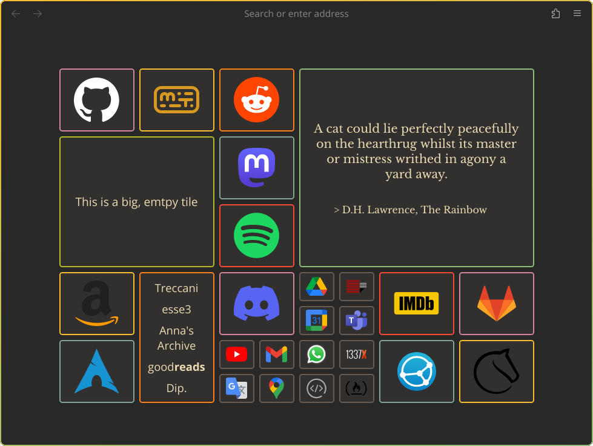

<h1 align="center">NewTab</h1>

[zombieFox](https://github.com/zombieFox)'s [nightTab](https://github.com/zombieFox/nightTab) extension inspired me to make my own startpage.

NewTab is meant to be nothing more than a page with a bunch of links, and maybe some useful or interesting information.

## Setup

Here are some guides:
- [Firefox](https://peterries.net/blog/firefox-set-file-as-home/);
- [LibreWolf](https://codetea.com/a-guide-to-make-librewolf-have-a-different-start-page-for-the-homepage-and-new-tabs/).

### Chromium

1. Go to `chrome://extensions`
2. Turn on "Developer mode" in the-top left corner
3. Finally click "Load unpacked" and select the root of the extension directory (in this case `src`).
