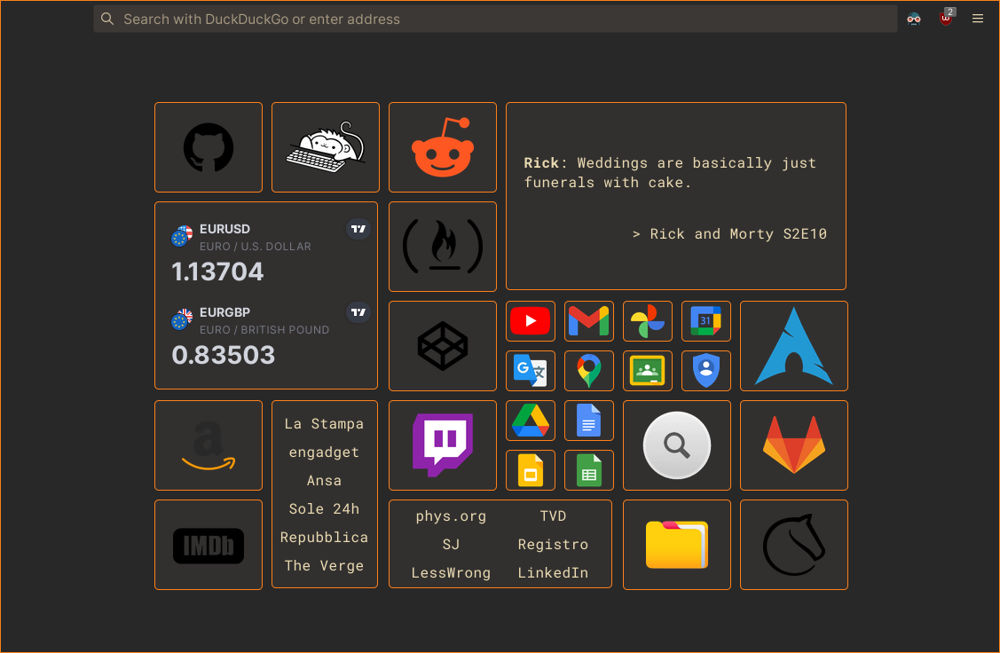

[zombieFox](https://github.com/zombieFox)'s [nightTab](https://github.com/zombieFox/nightTab) browser extension inspired me to make my very own new tab page.

# Setup

### Firefox 
[This article](https://peterries.net/blog/firefox-set-file-as-home/) might still work.

### LibreWolf
The procedure is similar to that of Firefox. [Here is an article](https://codetea.com/a-guide-to-make-librewolf-have-a-different-start-page-for-the-homepage-and-new-tabs/).

### Chromium
From the broswer extensions page turn on the **Developer mode**. Then click **Load unpacked** and select the extension directory. 
